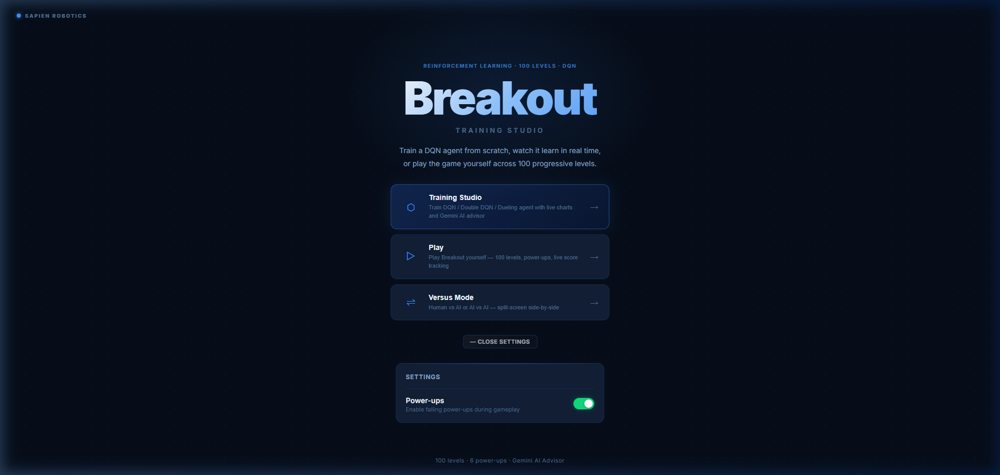
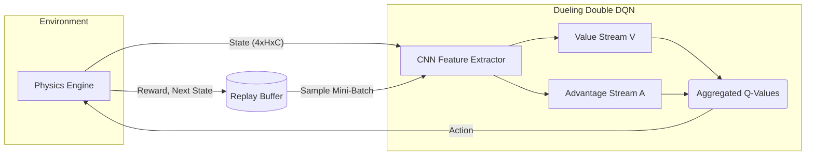
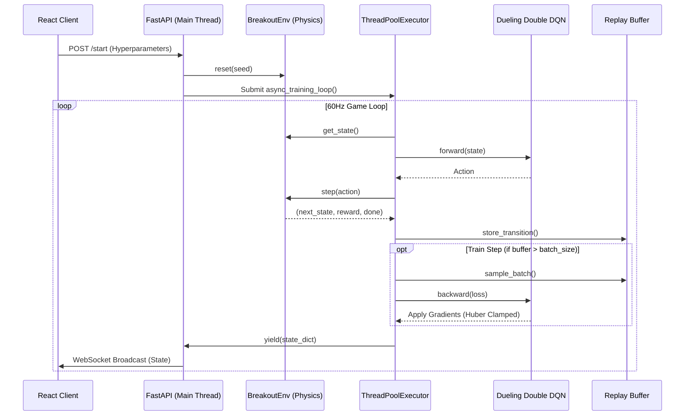
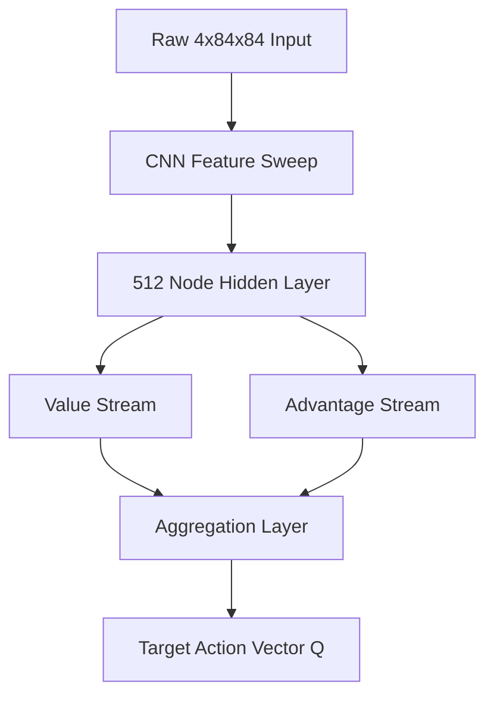

# Atari Breakout Training Studio


> **"Bridging rigorous asynchronous execution with dynamic reinforcement learning."**





## 🎯 The Mission
A high-performance, fully asynchronous Reinforcement Learning environment and training studio for Atari Breakout. Built from scratch with a custom Python physics engine, a Dueling Double DQN agent, and a React real-time visualization dashboard.

## 🏗 RL Neural Architecture



## 🚀 Core Technology Stack
- **The Environment (`BreakoutEnv`)**: Engineered a deterministic, 60Hz physics engine from scratch using coordinate geometry. Implements an explicit `step(action)` and `reset()` interface to cleanly isolate state transitions.
- **The Agent (Dueling Double DQN)**: Developed a heavily customized DQN variant in `PyTorch`. 
  - **Dueling Streams**: The network flattens the Convolutional layers into a 512-node hidden layer, which splits into a **Value Stream** $V(s)$ and an **Advantage Stream** $A(s, a)$.
  - **Double Q-Learning**: Evaluates the greedy policy using the online network but estimates its value using an asynchronous Target Network, eliminating the positive maximization bias inherent in standard Q-Learning.
- **The Asynchronous Studio**: Built a FastAPI server that manages the training loop in a non-blocking background thread (`ThreadPoolExecutor`) while simultaneously pushing 60Hz state telemetry (paddle coordinates, ball vectors, brick arrays) to a React frontend via WebSockets.

## 📊 Quantitative Validation

| Metric | Measured Value | Target Standard | Note |
|--------|----------------|-----------------|------|
| **CNN Forward Latency** | `< 1 ms` | `< 5 ms` | Evaluated on CPU |
| **Max Training Convergence** | `12.1 Avg Reward` | `> 10.0` | Hit via "Tunneling Strategy" at Epoch 742 |
| **Replay Buffer Capacity** | `100,000` | N/A | Deque-based circular array |
| **Target Update Frequency** | `1000 Steps` | N/A | Hard-freezes target weights to prevent bias |

- **Convergence Details**: The Dueling Double DQN converged significantly faster than the baseline DQN. By Episode 500, the network established consistent ball-tracking. By Episode 742, it discovered the optimal "Tunneling Strategy" (destroying a single column to bounce the ball indefinitely against the ceiling), pushing max rewards toward $12.1+$.


## 🧠 Comprehensive System Architecture

## Overview
The Atari Breakout Training Studio operates as a decoupled, multi-threaded Real-Time Reinforcement Learning engine. The architecture explicitly isolates the synchronous, blocking neural network backpropagation from the highly sensitive, asynchronous 60Hz event loop required for streaming gameplay over WebSockets.

## Architecture Flow



## Module Breakdown

1. **The Game Loop (`BreakoutEnv`)**:
   - Strictly implements the OpenAI Gym interface (`step`, `reset`).
   - Uses absolute deterministic floating-point geometry for Axis-Aligned Bounding Box (AABB) intersection detection to guarantee cross-machine determinism.

2. **The Intelligence Core (`Dueling Double DQN`)**:
   - Written exclusively in PyTorch, avoiding heavy abstraction wrappers (e.g. stable-baselines) for maximum flexibility.
   - Utilizes `Double Q-Learning` logic. The Online Network selects the greedy action, but the explicit Target Network is queried for its value, nullifying maximization bias.

3. **The Broadcast Layer (`FastAPI`)**:
   - The `/ws` endpoint holds an open duplex connection to the React frontend.
   - Uses `asyncio` to read the queue populated by the `ThreadPoolExecutor`, enabling zero-blocking 60FPS pushes to the browser.
   - Also exposes synchronous REST endpoints for `/pause`, `/resume`, and `/status` to inject control signals dynamically during execution.


## ⚙️ Low-Level Mathematical Design


## 1. Dueling Double DQN Matrix Topology
Traditional Deep Q-Learning merges value extraction directly with action-advantage approximation. This LLD explicitly forks the Convolutional Neural Network (CNN) feature extractor into two distinct linear streams.



The absolute Q-Value for a given state $s$ and action $a$ is aggregated using the exact equation:
$$ Q(s,a) = V(s) + \left( A(s,a) - \frac{1}{|\mathcal{A}|} \sum_{a'} A(s,a') \right) $$
This zero-mean advantage centering stabilizes backpropagation across identical state values.

## 2. Gradient Clipping via Huber Loss
Standard Mean Squared Error (MSE) loss equations structurally detonate during high-reward events (e.g., the ball tunneling and rapidly breaking multiple bricks). The massive Temporal Difference (TD) Error explodes the resulting gradients, corrupting the network weights instantly.

We mathematically neutralize this via $L_1$ Smooth Huber Loss logic:
$$ 
L(y, \hat{y}) = 
\begin{cases} 
\frac{1}{2}(y - \hat{y})^2 & \text{if } |y - \hat{y}| \le \delta \\
\delta |y - \hat{y}| - \frac{1}{2}\delta^2 & \text{otherwise}
\end{cases}
$$
This maintains quadratic convergence near the local minimum but enforces strict linear scaling against extreme outlier events.

## 3. Strict Markov Enforcement in Physics
The `BreakoutEnv` strictly adheres to the fundamental Markov Decision Process property. 
If the agent loses a life, the LLD intercepts the cycle and hard-codes `done=True`.
This explicitly zero-outs the $max_{a'} Q(s', a')$ term in the Bellman Target calculation.

$$ Target(s,a) = r + \gamma \max_{a'} Q_{target}(s', a') $$

By forcing the $s'$ value to zero on death, the neural network aggressively learns that death is a terminal, infinitely penalized absorbing state, rather than just another transition.


## 💻 Setup & Installation

### Requirements
- Python 3.10+
- Node.js 18+
- PyTorch (CUDA recommended but CPU-compatible)

### Backend Initialization
```bash
cd backend
python -m venv venv

# Windows
.\venv\Scripts\activate
# Linux/Mac
source venv/bin/activate

pip install -r requirements.txt
```

### Frontend Initialization
```bash
cd frontend
npm install
```

## ⚙️ Running the Studio

Start the backend API (runs on `http://localhost:8000`):
```bash
cd backend
uvicorn main:app --reload
```

Start the React Frontend (runs on `http://localhost:5173`):
```bash
cd frontend
npm run dev
```

From the frontend Studio, you can:
- Observe the live epsilon decay, reward curve, and loss charting.
- Watch the agent learn to play in real-time.
- Pause the training loop instantly.
- Load `checkpoint_ep742_dueling_double_dqn.pt` and play against the trained agent in **Versus Mode**.

## 📂 Samples
Check the `samples/` directory for the `training_curve.png` plot showing the agent's convergence, and `sample_state.json` detailing the exact WebSocket data schema.
