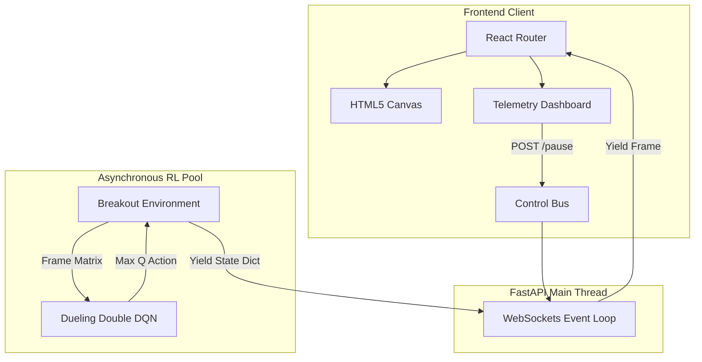

# High Level Design (HLD)

> **"Bridging rigorous asynchronous execution with dynamic reinforcement learning."**

## 1. Core Subsystems Overview
The studio explicitly splits synchronous neural optimization away from asynchronous telemetry streaming.

### 1.1 Fast Deterministic Physics (`BreakoutEnv`)
Operates using pure Python floating-point matrices. By relying strictly on mathematically deterministic Axis-Aligned Bounding Box (AABB) collisions, the environment runs millions of ticks without external physics-engine overhead or frame skips.

### 1.2 ThreadPool Execution Context
Backpropagating deep convolutional networks is intrinsically thread-blocking. We offload this explicitly to an asynchronous ThreadPool. The engine trains at max CPU/GPU capacity while safely yielding non-blocking telemetry vectors back to the main thread.

### 1.3 React Visualization Client
Connects strictly via `ws://` protocols. Receives the flattened JSON payload and natively repaints an HTML5 Canvas at exactly 60 FPS.

## 2. Component Architecture Chart

## 3. Interfaces & Telemetry
| Interface | Protocol | Throughput / Latency Target | Description |
|-----------|----------|-----------------------------|-------------|
| **`/api/status`** | REST | `< 1 ms` | Synchronous state check |
| **`/ws`** | WebSocket | `16.6 ms (60Hz)` | Zero-blocking streaming tensor dump |
| **`CNN Forward`**| PyTorch JIT | `< 1 ms` | Forward pass matrix multiplication |
