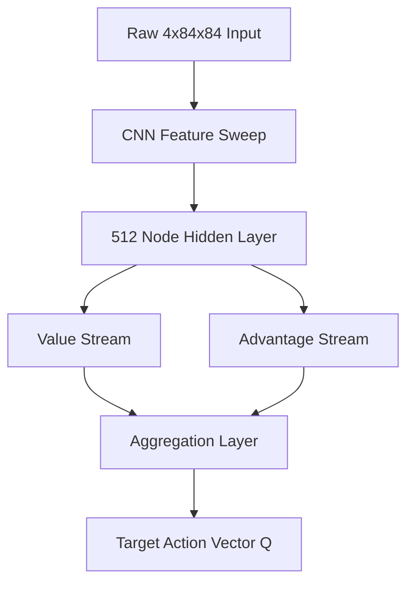

# Low Level Design (LLD)

> **"Mathematical determinism across continuous contextual chunking."**

## 1. Dueling Double DQN Matrix Topology
Traditional Deep Q-Learning merges value extraction directly with action-advantage approximation. This LLD explicitly forks the Convolutional Neural Network (CNN) feature extractor into two distinct linear streams.

The absolute Q-Value for a given state $s$ and action $a$ is aggregated using the exact equation:
$$ Q(s,a) = V(s) + \left( A(s,a) - \frac{1}{|\mathcal{A}|} \sum_{a'} A(s,a') \right) $$
This zero-mean advantage centering stabilizes backpropagation across identical state values.

## 2. Gradient Clipping via Huber Loss
Standard Mean Squared Error (MSE) loss equations structurally detonate during high-reward events (e.g., the ball tunneling and rapidly breaking multiple bricks). The massive Temporal Difference (TD) Error explodes the resulting gradients, corrupting the network weights instantly.

We mathematically neutralize this via $L_1$ Smooth Huber Loss logic:
$$ 
L(y, \hat{y}) = 
\begin{cases} 
\frac{1}{2}(y - \hat{y})^2 & \text{if } |y - \hat{y}| \le \delta \\
\delta |y - \hat{y}| - \frac{1}{2}\delta^2 & \text{otherwise}
\end{cases}
$$
This maintains quadratic convergence near the local minimum but enforces strict linear scaling against extreme outlier events.

## 3. Strict Markov Enforcement in Physics
The `BreakoutEnv` strictly adheres to the fundamental Markov Decision Process property. 
If the agent loses a life, the LLD intercepts the cycle and hard-codes `done=True`.
This explicitly zero-outs the $max_{a'} Q(s', a')$ term in the Bellman Target calculation.

$$ Target(s,a) = r + \gamma \max_{a'} Q_{target}(s', a') $$

By forcing the $s'$ value to zero on death, the neural network aggressively learns that death is a terminal, infinitely penalized absorbing state, rather than just another transition.
