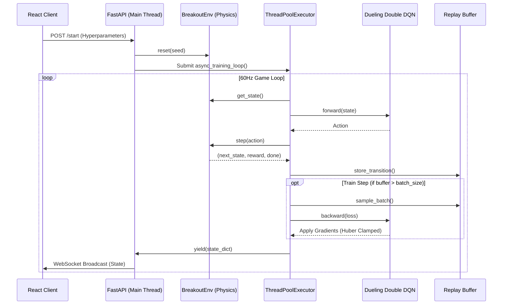

# System Architecture

## Overview
The Atari Breakout Training Studio operates as a decoupled, multi-threaded Real-Time Reinforcement Learning engine. The architecture explicitly isolates the synchronous, blocking neural network backpropagation from the highly sensitive, asynchronous 60Hz event loop required for streaming gameplay over WebSockets.

## Architecture Flow

## Module Breakdown

1. **The Game Loop (`BreakoutEnv`)**:
   - Strictly implements the OpenAI Gym interface (`step`, `reset`).
   - Uses absolute deterministic floating-point geometry for Axis-Aligned Bounding Box (AABB) intersection detection to guarantee cross-machine determinism.

2. **The Intelligence Core (`Dueling Double DQN`)**:
   - Written exclusively in PyTorch, avoiding heavy abstraction wrappers (e.g. stable-baselines) for maximum flexibility.
   - Utilizes `Double Q-Learning` logic. The Online Network selects the greedy action, but the explicit Target Network is queried for its value, nullifying maximization bias.

3. **The Broadcast Layer (`FastAPI`)**:
   - The `/ws` endpoint holds an open duplex connection to the React frontend.
   - Uses `asyncio` to read the queue populated by the `ThreadPoolExecutor`, enabling zero-blocking 60FPS pushes to the browser.
   - Also exposes synchronous REST endpoints for `/pause`, `/resume`, and `/status` to inject control signals dynamically during execution.
