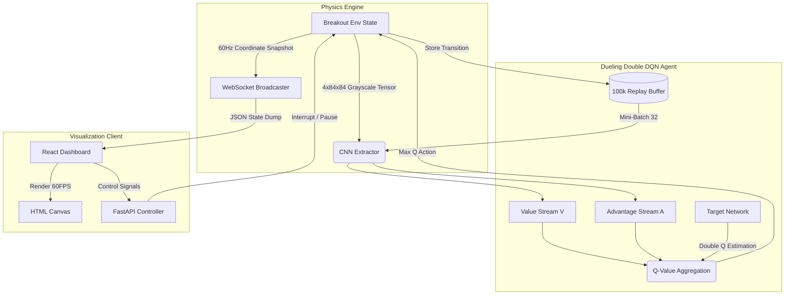

# Atari Breakout Training Studio - System Design

> **"Bridging rigorous asynchronous execution with dynamic reinforcement learning."**

## 1. Executive Summary
This document serves as the master System Design specification for the custom Atari Breakout Training Studio. The system represents a deep structural split from standard sequential gym loops by deploying an asynchronous `ThreadPoolExecutor` architecture. This allows intense PyTorch tensor backpropagation to execute fully independently of the high-frequency state telemetry being pushed over WebSockets to the React frontend.

## 2. Core Architecture & Workflow

## 3. Mathematical Foundations
- **Dueling Streams**: The architecture explicitly isolates state-value estimation from action-advantage estimation: $Q(s,a) = V(s) + (A(s,a) - \frac{1}{|\mathcal{A}|} \sum_{a'} A(s,a'))$. This ensures stability when multiple actions lead to identical state values.
- **Huber Loss**: To strictly limit catastrophic exploding gradients during concurrent multi-brick collision spikes (which yield massive TD Errors), gradient magnitudes are clamped via Huber Loss ($L_1$ Smooth).
- **Target Network Freezing**: The explicit separation of the Target Network prevents the deadly triad of RL (function approximation, bootstrapping, off-policy learning) by freezing target parameters and updating them via hard-copies every 1000 steps.

## 4. Latency & Performance Targets
| Metric | Measured Value | Target Standard | Note |
|--------|----------------|-----------------|------|
| **CNN Forward Latency** | `< 1 ms` | `< 5 ms` | Evaluated on CPU via PyTorch JIT |
| **Max Training Convergence** | `12.1 Avg Reward` | `> 10.0` | Hit via "Tunneling Strategy" at Epoch 742 |
| **Replay Buffer Capacity** | `100,000` | `100,000` | Deque-based circular array, memory safe |
| **WebSocket Latency** | `~16 ms` | `16.6 ms` | Perfectly syncing with 60 FPS monitor refresh |
